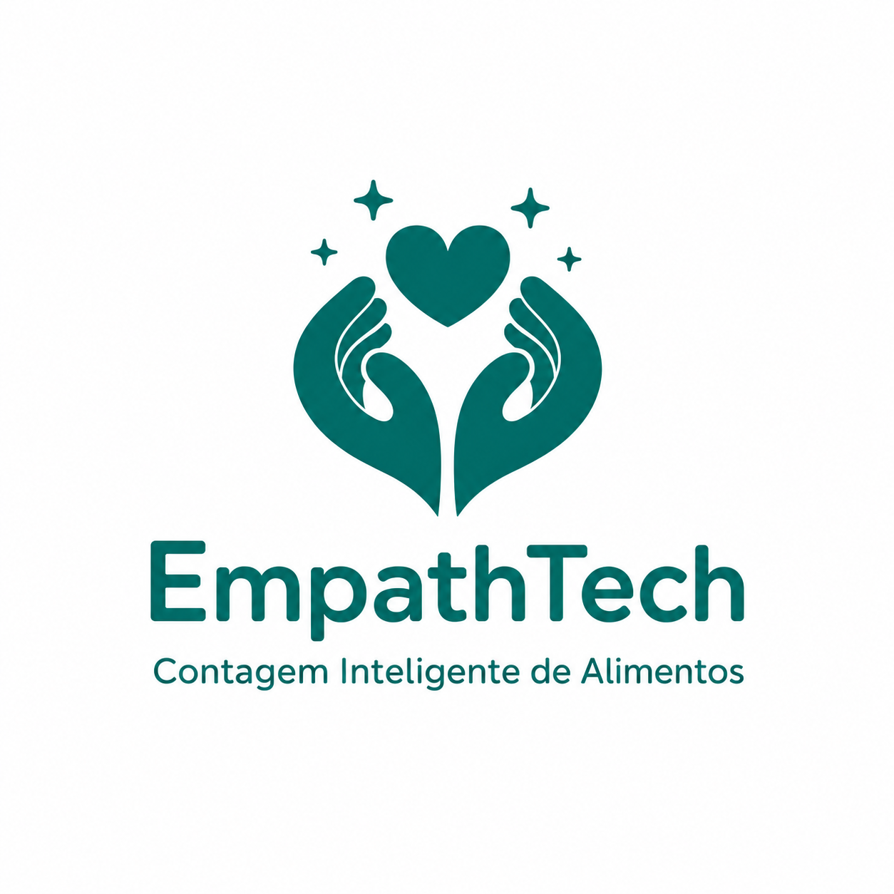

# FECAP - Fundação de Comércio Álvares Penteado

<p align="center">
<a href= "https://www.fecap.br/"></a>
</p>

# EmpathTech

## Grupo 7 - EmpathTech

## Integrantes: <a href= "https://github.com/carlinhoslatorre"> Carlos Roberto Santos Latorre</a>, <a href = "https://www.linkedin.com/in/felipeosantosojo/ "> Felipe Oluwaseun Santos Ojo</a>,<a href= "https://www.linkedin.com/in/felipe-wakasa-76a93a257/"> Felipe Wakasa Klabunde</a>, <a href= "https://www.linkedin.com/in/stephany-aliyah-4a2589321/"> Stephany Aliyah Guimarães Eurípedes de Paula</a>


## Professores Orientadores: <a href="https://www.linkedin.com/in/marcos-minoru-nakatsugawa/">Marcos Minoru Nakatsugawa</a>,<a href="https://www.linkedin.com/in/rafael-diogo-rossetti/">Rafael Diogo Rossetti</a>, <a href="https://www.linkedin.com/in/rodrigo-da-rosa-phd/">Rodrigo da Rosa</a>, <a href="https://www.linkedin.com/in/professorrodnil/">Rodnil da Silva Moreira Lisbôa</a>, <a href="https://www.linkedin.com/in/victorbarq/">Victor Bruno Alexander Rosetti de Quiroz</a>
## Descrição

<p align="center">
  
</p>

<p align="center">
  Project by Carlos Roberto, Felipe Oluwaseun, Felipe Wakasa e Stephany Aliyah.
</p>

O **EmpathTech** foi desenvolvido para apoiar campanhas de arrecadação de alimentos, principalmente na etapa de contagem e organização dos itens recebidos. Em muitas ações sociais, esse controle ainda é feito manualmente, o que pode causar atrasos, erros na triagem e dificuldade para acompanhar com precisão a quantidade de alimentos arrecadados. A proposta do projeto é facilitar esse processo, oferecendo uma forma mais ágil e confiável de registrar as doações.

Para isso, o sistema utiliza **Inteligência Artificial** e **Visão Computacional** para identificar os alimentos a partir de imagens e registrar as informações de maneira automatizada. A solução também integra banco de dados e computação em nuvem, permitindo que os dados sejam armazenados e consultados com mais organização. Dessa forma, o EmpathTech busca contribuir com o trabalho das instituições e voluntários, ajudando na gestão das doações e permitindo que mais tempo seja dedicado à distribuição dos alimentos para quem precisa.

<br><br>

## 🛠 Estrutura de pastas

```text
Raiz
|
|--> documentos
|   |
|   |--> Entrega 1
|   |   |--> Inteligência Artificial e Aprendizado de Máquina
|   |   |--> Projeto Interdisciplinar - Inteligência Artificial
|   |   |--> Psicologia, Liderança e Soft Skills
|   |   |--> Sistemas Operacionais e Computação em Nuvem
|   |   |--> Álgebra Linear, Vetores e Geometria Analítica
|   |
|   |--> Entrega 2
|       |--> Inteligência Artificial e Aprendizado de Máquina
|       |--> Projeto Interdisciplinar - Inteligência Artificial
|       |--> Psicologia, Liderança e Soft Skills
|       |--> Sistemas Operacionais e Computação em Nuvem
|       |--> Álgebra Linear, Vetores e Geometria Analítica
|   
|   
|
|--> imagens
|
|--> src
|   |--> Backend
|   |--> Frontend
|
|--> README.md
```

📄 **README.md**: Arquivo que serve como guia e explicação geral sobre o projeto.

Há também 3 pastas principais que seguem da seguinte forma:

🗂️ **documentos**: Toda a documentação geral do projeto, incluindo as entregas das disciplinas do semestre.

📷 **imagens**: Imagens utilizadas para documentação, apresentação e explicação do projeto.

🧑‍💻 **src**: Pasta que contém o código-fonte da aplicação, separado entre frontend e backend.


## 🛠 Instalação

<b>Android:</b>

Faça o Download do JOGO.apk no seu celular.
Execute o APK e siga as instruções de seu telefone.

```sh
Coloque código do prompt de comnando se for necessário
```

<b>Windows:</b>

Não há instalação! Apenas executável!
Encontre o JOGO.exe na pasta executáveis e execute-o como qualquer outro programa.

```sh
Coloque código do prompt de comnando se for necessário
```

<b>HTML:</b>

Não há instalação!
Encontre o index.html na pasta executáveis e execute-o como uma página WEB (através de algum browser).

## 💻 Configuração para Desenvolvimento

Descreva como instalar todas as dependências para desenvolvimento e como rodar um test-suite automatizado de algum tipo. Se necessário, faça isso para múltiplas plataformas.

Para abrir este projeto você necessita das seguintes ferramentas:

-<a href="https://godotengine.org/download">GODOT</a>

```sh
make install
npm test
Coloque código do prompt de comnando se for necessário
```


## 📋 Licença/License

<p xmlns:cc="http://creativecommons.org/ns#" xmlns:dct="http://purl.org/dc/terms/">

  <a property="dct:title" rel="cc:attributionURL" href="https://github.com/2026-1-NCC5/Projeto7">
    EmpathTech
  </a>
  by
  <a href="https://github.com/2026-1-NCC5/Projeto7" rel="cc:attributionURL dct:creator" property="cc:attributionName">
    Carlos Roberto Santos Latorre
  </a>,
  <a href="https://github.com/2026-1-NCC5/Projeto7" rel="cc:attributionURL dct:creator" property="cc:attributionName">
    Felipe Oluwaseun Santos Ojo
  </a>,
  <a href="https://github.com/2026-1-NCC5/Projeto7" rel="cc:attributionURL dct:creator" property="cc:attributionName">
    Felipe Wakasa Klabunde
  </a>,
  <a href="https://github.com/2026-1-NCC5/Projeto7" rel="cc:attributionURL dct:creator" property="cc:attributionName">
    Stephany Aliyah Guimarães Eurípedes de Paula
  </a> is licensed under
  <a href="https://creativecommons.org/licenses/by/4.0/?ref=chooser-v1"
     target="_blank" rel="license noopener noreferrer" style="display:inline-block;">
     CC BY 4.0
    
    
  </a>

</p>

## 🎓 Referências

1. Python: <https://www.python.org/>

2. React: <https://react.dev/>

3. Node.js: <https://nodejs.org/>

4. Label Studio: <https://labelstud.io/>

5. YOLO: <https://docs.ultralytics.com/>

6. PostgreSQL: <https://www.postgresql.org/>

7. AWS RDS: <https://aws.amazon.com/pt/rds/>
